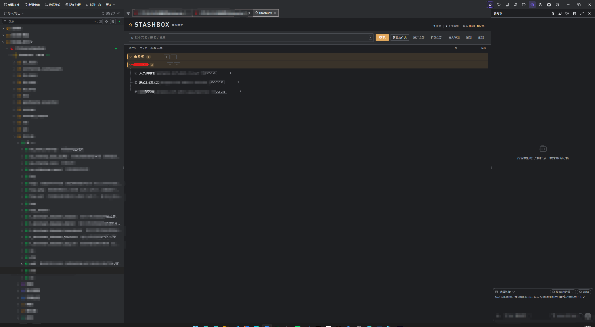
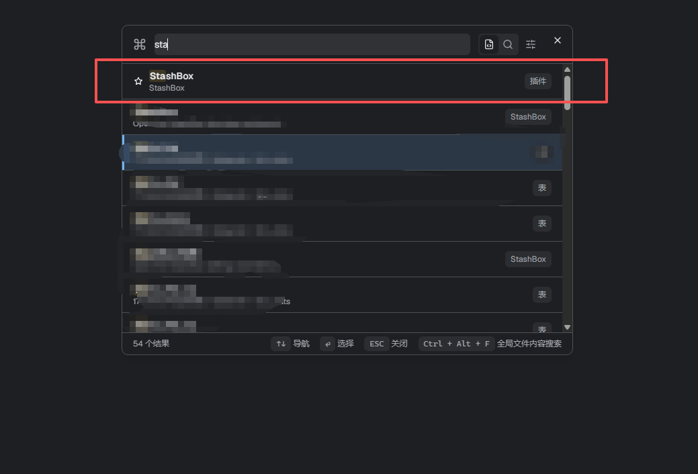
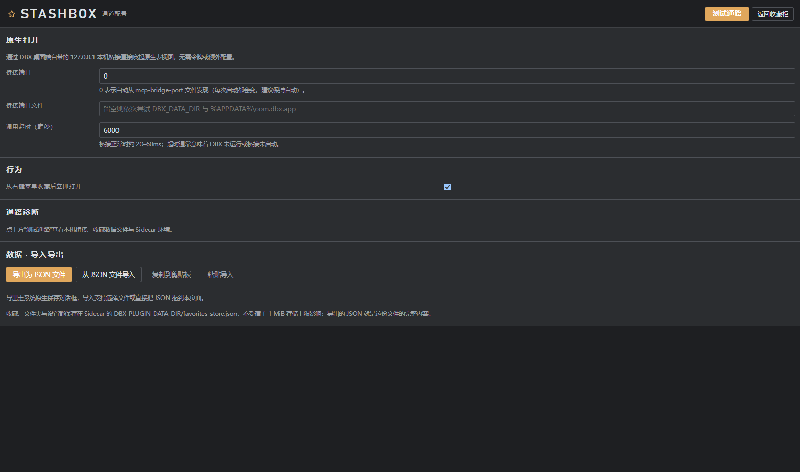

# StashBox · DBX 表收藏插件

[](LICENSE)
[](#从源码构建)
[](https://dbxio.com/cn/docs/plugin-development)

把常用数据库表收藏进**文件夹**，在专用的「收藏柜」工作台里搜索、归类，并一键回到 **DBX 原生表视图**。插件通过 DBX 桌面端自带的本机回环桥接（loopback bridge）唤起原生打开，不经过任何第三方服务。

- 插件 ID：`io.stashbox.dbx.favorites`
- 支持平台：Windows x64（Sidecar 为 .NET Framework 单文件程序，无需运行时安装）

---

## 截图

> 📸 **截图待补充**：请把截图放入 `doc/screenshots/` 目录，文件名与下方链接保持一致即会自动显示；建议同时提供暗色/亮色各一张，宽度 1280px 左右的 PNG。

### 收藏柜主界面（文件夹分组 · 搜索 · 打开次数）



### 收藏对话框（选择文件夹 · 仅收藏 / 收藏并打开）


### 快速打开收藏的表（命令面板）



### 配置与通路诊断



---

## 功能特性

- **右键一键收藏**：在连接树的表节点上右键 →「收藏此表」，可填写中文名称、选择目标文件夹。
- **两种收藏动作**：对话框始终提供「**仅收藏**」（不打断当前工作）与「**收藏并打开**」，默认主按钮可在配置中切换。
- **文件夹归类**：支持多级文件夹、展开/折叠记忆、全部展开/全部折叠；收藏时自动记住上次选择的文件夹。
- **收藏柜工作台**：按文件夹分组浏览，支持关键字过滤、打开次数与最近打开时间展示。
- **快速打开**：命令面板执行「快速打开收藏的表」，模糊选中后直接唤起 DBX 原生表视图。
- **原生体验**：打开的是 DBX 自己的表视图（不是插件内的网页表格），支持亮色/暗色主题自动跟随宿主。
- **键盘导航**：`↑` / `↓` 移动、`Enter` 打开或展开、`←` / `→` 折叠/展开文件夹、`/` 聚焦搜索框。
- **数据可迁移**：收藏数据支持导出 / 导入 JSON 文件，也可走系统剪贴板复制 / 粘贴。
- **通路诊断**：配置页一键检测本机桥接端口、数据文件与 Sidecar 环境。

## 安装（未签名开发包）

本仓库提供的是**未签名候选包**，DBX 默认只允许安装官方签名包，需先开启开发者开关：

1. 前往 [Releases](https://github.com/c475570815/dbx-favorites/releases) 下载 `io.stashbox.dbx.favorites-<版本>-windows-x64.dbxp`。
2. 打开 DBX → **插件中心 → 设置**，勾选「**允许安装未签名开发包**」。
3. 将 `.dbxp` 拖入插件中心（或通过安装入口选择该文件）。
4. 安装后从右侧工具栏 / 侧边栏的 StashBox 入口打开收藏柜；在任意表节点上右键即可看到「收藏此表」。

> 也可以直接从源码构建，见下一节。

## 从源码构建

只需要 Windows 自带的 .NET Framework 编译器（`csc.exe`）与 PowerShell，无需安装 .NET SDK 或 Node.js：

```powershell
git clone https://github.com/c475570815/dbx-favorites.git
cd dbx-favorites
powershell -ExecutionPolicy Bypass -File .\build.ps1
```

脚本会依次完成：

1. 编译 `backend/*.cs` → `bin/dbx-favorites.exe`；
2. 运行 Sidecar 自检（JSON 往返、桥接端口探测、存储加载）；
3. 打包为 `dist/io.stashbox.dbx.favorites-<版本>-windows-x64.dbxp`（zip + `checksums.json`）。

只想重新打包（已编译过）时使用 `.\build.ps1 -SkipBuild`。

## 使用指南

### 收藏一张表

- 在连接树中右键目标表 →「**收藏此表**」；
- 填写中文名称（可选，留空则显示原始表名）、选择文件夹；
- 点击「**仅收藏**」只保存，或「**收藏并打开**」保存后立即在原生表视图中打开。

### 管理收藏

- 拖动 / 使用行内菜单可移动、重命名、删除收藏；
- 支持编辑备注；重复收藏同一连接下的同一张表会自动识别为已存在，不会产生重复条目；
- 顶部工具条可全部展开 / 折叠、切换视图、进入配置页。

### 快速打开

- `Ctrl/Cmd + P` 打开命令面板 →「快速打开收藏的表」，或直接点击工具栏入口；
- 列表按收藏内容过滤，`Enter` 即唤起原生表视图。

### 导入 / 导出

- 配置页底部可将全部收藏、文件夹与设置导出为 JSON；
- 换机器时把该 JSON 拖入收藏柜，或通过「粘贴导入」恢复。

### 配置项

| 配置 | 说明 |
|---|---|
| 桥接端口 | 默认 `0`，自动从 DBX 写入的 `mcp-bridge-port` 文件发现（端口每次启动可能变化，建议保持自动） |
| 桥接端口文件 | 自动发现失败时可手动指定端口文件路径 |
| 调用超时（毫秒） | 打开表的 HTTP 超时，正常约 20–60ms |
| 收藏后立即打开 | 控制收藏对话框的默认主按钮是「收藏并打开」还是「仅收藏」 |

## 工作原理

```text
┌─────────────────────────────┐        JSON-RPC (stdio JSONL, Sidecar Protocol v1)
│  ui/  沙箱工作台 (原生 JS)    │ ◄──────────────────────────────────────────────┐
│  收藏柜 / 配置 / 导入导出      │                                                │
└──────────────┬──────────────┘                                         ┌──────┴──────┐
               │ window.dbxPlugin.invoke                                │ C# Sidecar  │
               ▼                                                         │ bin/*.exe   │
        DBX Host API（工作台 / 连接列表 / 上下文事件）                    └──────┬──────┘
                                                                                 │ HTTP（仅 127.0.0.1）
                                                                                 ▼
                                                                      DBX 本机回环桥接 /open-table
                                                                                 │
                                                                                 ▼
                                                                      DBX 原生表视图（由宿主打开）
```

- **打开通道**：Sidecar 只调用 DBX 桌面端在 `127.0.0.1` 监听的本机桥接 `/open-table`，不依赖 MCP、不需要令牌，也不访问任何外网地址。
- **数据存储**：收藏数据保存在 Sidecar 数据目录下的 `favorites-store.json`（由 DBX 通过 `DBX_PLUGIN_DATA_DIR` 注入）。写入采用临时文件 + 原子替换，加载失败会自动备份损坏文件并降级为空库，不受宿主 1 MiB 存储上限影响。
- **身份去重**：以「连接 + database + schema + table」作为收藏身份；连接标识缺失时不会把不同连接的同名表误判为同一条。
- **主题跟随**：UI 通过宿主注入的 CSS 变量推断亮 / 暗色，并设置 `color-scheme`，保证原生下拉列表、滚动条等 UA 控件也跟随暗色主题。

## 权限说明

`manifest.json` 仅声明最小权限：

| 权限 | 用途 |
|---|---|
| `host.workbench` | 打开收藏柜 / 配置工作台、注册表右键菜单与命令入口 |

插件不读取连接凭据、不执行 SQL、不访问用户文件系统（导入导出走宿主文件对话框 / 剪贴板）。

## 项目结构

```text
dbx-favorites/
├── manifest.json        # 插件清单：身份、权限、入口、命令与菜单贡献点
├── dbx-plugin.toml      # 打包配置（包含 assets/ ui/ bin/）
├── build.ps1            # 编译 + 自检 + 打包脚本
├── assets/
│   └── plugin.svg       # 插件图标
├── ui/                  # 沙箱工作台前端（无框架、无构建步骤）
│   ├── index.html
│   ├── cabinet.css
│   ├── host.js          # Host API 封装、弹窗、Toast、主题同步
│   ├── tree.js          # 收藏树渲染与键盘导航
│   ├── favorites.js     # 收藏柜主页面
│   ├── settings.js      # 配置与通路诊断
│   └── transfer.js      # JSON 导入导出 / 剪贴板 / 拖拽
├── backend/             # C# 原生 Sidecar（.NET Framework 4.x，零依赖）
│   ├── Program.cs       # JSON-RPC 方法与收藏业务逻辑
│   ├── Bridge.cs        # DBX 本机回环桥接 HTTP 客户端
│   ├── Store.cs         # JSON 存储：原子写入、损坏备份、旧设置清洗
│   └── Json.cs          # JSON 序列化 / 反序列化
└── doc/                 # 文档与截图
```

## 上架 DBX 官方商店

按[官方插件开发指南](https://dbxio.com/cn/docs/plugin-development)的流程，插件源码与未签名候选包留在本仓库；正式上架时：

1. 在本仓库发布对应版本的 GitHub Release（附带 `.dbxp` 与 `release-candidates.json`）；
2. 向 [`t8y2/dbx-store`](https://github.com/t8y2/dbx-store) 的 `main` 分支提交一个 PR，新增 `candidates/io.stashbox.dbx.favorites.json`（首次提交还需 `publishers/stashbox.json`）；
3. 维护者审核后运行签名工作流，签名包进入官方目录，客户端即可直接安装。

## 开源协议

[MIT License](LICENSE)
